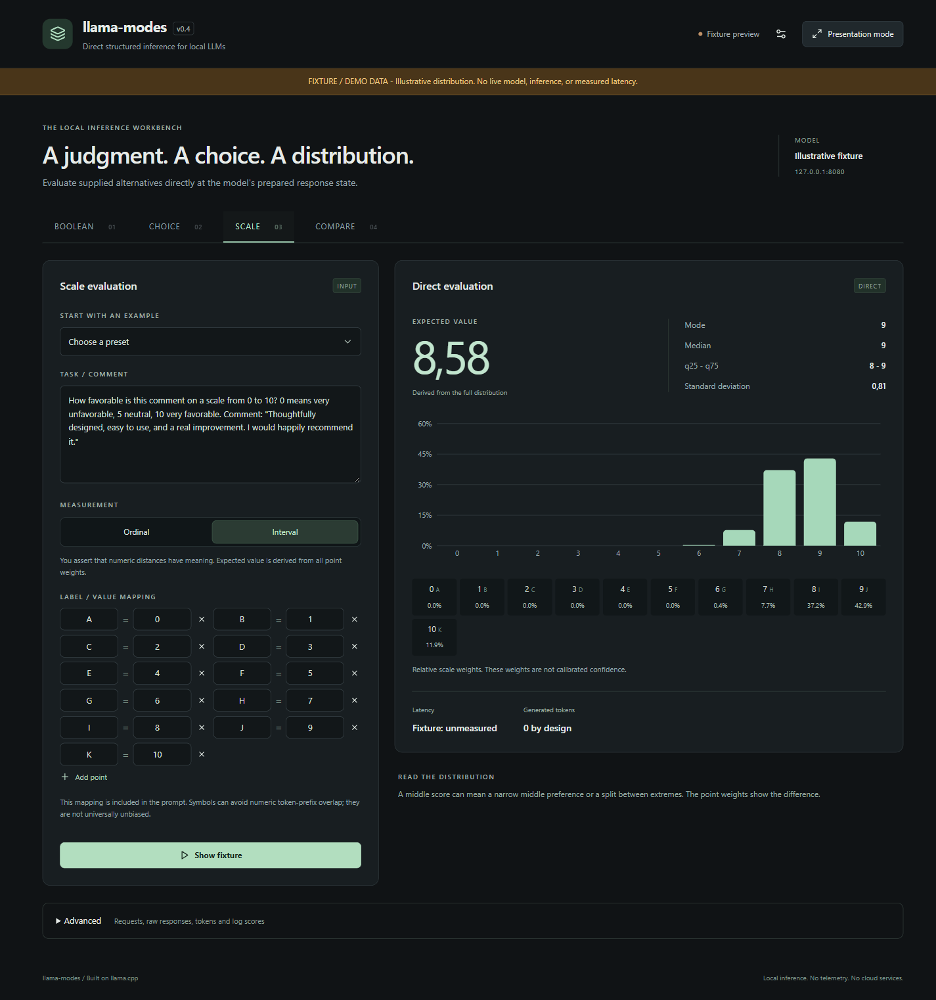

# llama-modes

**Load one GGUF once: normal chat, direct structured scoring, and one context for many independent questions in v0.5.0.**

LLM applications often need a judgment rather than generated prose. llama-modes scores supplied alternatives at a prepared model evaluation state and returns a structured result. Direct is a structured readout from that state, not shortened Chat, and does not universally replace reasoning.

**[Quick start](docs/quickstart.md) | [Demo](demo/README.md) | [Cookbook](docs/cookbook.md) | [API: Decision](docs/decision.md) / [SCALE](docs/scale.md) / [Evaluate](docs/evaluate.md) | [Benchmark methodology](docs/benchmark-methodology.md) | [Releases](https://github.com/loo5x/llama-modes/releases)**

## Shared-context multi-question evaluation

v0.5.0 adds experimental `POST /evaluate`: submit one shared context and multiple independent Boolean, Choice, or Scale questions in one request. With optional sharing enabled, the eligible common prompt prefix is evaluated once, then reused while each question is prepared and scored independently. Questions never see one another's answers.

```text
shared context
      |
      +--> BOOLEAN
      +--> CHOICE
      +--> SCALE
      +--> BOOLEAN
```

Enable the endpoint with `--evaluate`; add `--evaluate-shared-prefix` to reuse complete batches of the common tokenized prefix. Each question's remaining prompt and candidate prefixes still require evaluation. Fresh evaluation is the default and the fallback when sharing is ineligible. Reuse is confined to one request, not a persistent context session across requests. The optimization must preserve independent-evaluation semantics under the same runtime configuration.

This is orchestration of the three scoring primitives below. [Run the v0.5 example](docs/quickstart.md#8-v05-multiple-questions-optional) or read the [API and limits](docs/evaluate.md).

## Three structured scoring primitives

| Mode | Give it | Get back |
| --- | --- | --- |
| **BOOLEAN** | A question and Yes / No | Relative scores for both alternatives |
| **CHOICE** | Arbitrary labels, including multi-token labels | Candidate scores and token details |
| **SCALE** | Ordered points and label representations | A discrete distribution, mode, median, and quantiles; mean and spread for interval scales |

```text
CHAT         prompt -> autoregressive generation -> text answer
llama-modes  prompt -> prepared evaluation state -> score supplied alternatives -> structured result
```

| Capability | Behavior |
| --- | --- |
| Direct evaluation | Zero generated answer tokens; prompt and candidate-prefix evaluation still cost compute |
| Native messages | Uses the model's chat template at a supported assistant content boundary |
| Raw prompts | Caller controls the evaluation boundary |
| Local runtime | Your GGUF, llama-server, existing llama.cpp backends |
| Compatibility | Normal llama-server chat/completion behavior remains available |

## A 60-second example

With a llama-modes runtime and your GGUF already downloaded, start the server in PowerShell:

```powershell
.\llama-server.exe -m "C:\models\your-model.gguf" --host 127.0.0.1 --port 8080 -ngl 99 --jinja
```

In another terminal:

```powershell
$body = @{ messages = @(@{ role = 'user'; content = 'Is Paris the capital of France? Return only Yes or No.' }); choices = @('Yes', 'No') } | ConvertTo-Json -Depth 10
Invoke-RestMethod http://127.0.0.1:8080/decision -Method Post -ContentType 'application/json' -Body $body | ConvertTo-Json -Depth 20
```

For single-token labels, inspect each choice's `probability`. If a label has multiple tokens, the response uses `sum_log_probability` and `mean_log_probability` instead. [Understand the two formats](docs/decision.md).

## More than a single rating

For comment favorability from 0 to 10, an **illustrative, unmeasured** distribution might be:

```text
value      0  1  2  3  4  5  6  7    8    9    10
weight     0  0  0  0  0  0  0  10%  20%  60%  10%

mode: [9]     median: 9     expected_value: 8.7
```

`expected_value` is derived from the full discrete distribution; the model does not generate it directly. It appears only for interval scales, where the caller asserts that numeric distances have meaning. [Complete SCALE request and interpretation](docs/scale.md).

## Run the local demo

From this repository, with Node.js 22.12+:

```sh
cd demo
npm install
npm run dev
```

Open `http://127.0.0.1:5173`. Explore Boolean, Choice, SCALE, and sequential **Interactive comparison** with chat. The demo does not expose shared-context `/evaluate`; use the [API quickstart](docs/quickstart.md#8-v05-multiple-questions-optional) for that capability. Presentation mode enlarges results and charts. A loopback-only proxy connects to your server at `127.0.0.1:8080`; no cloud services, telemetry, or accounts are used. [Demo setup and settings](demo/README.md).



Screenshot: illustrative fixture data, not a model result or benchmark.

## Download and install

Download the published [v0.5.0 release](https://github.com/loo5x/llama-modes/releases/tag/v0.5.0): [llama-modes-v0.5.0-win-cuda.zip](https://github.com/loo5x/llama-modes/releases/download/v0.5.0/llama-modes-v0.5.0-win-cuda.zip) and its [SHA-256 checksum](https://github.com/loo5x/llama-modes/releases/download/v0.5.0/llama-modes-v0.5.0-win-cuda.zip.sha256). Supply your own GGUF model and keep the runtime DLLs together. The package targets Windows x64 and CUDA architecture 120; validation used RTX 5080. Check the packaged README for GPU/driver and runtime requirements.

For other builds, see the [source build guide](docs/build.md) for this fork. Validated binaries for other platforms are not promised. The [Windows quick start](docs/quickstart.md) covers extraction, model discovery, the three scoring primitives, shared-context evaluation, and the demo.

## Interpret results carefully

**Relative candidate/scale weights are not calibrated confidence.** Direct evaluation is not equivalent to autoregressive reasoning. Labels, tokenization, prompt wording, templates, and readout boundaries affect scores. SCALE is discrete, representation-sensitive, and can reject strict token-prefix collisions such as `1` versus `10` for some tokenizers. There is no claim of universally better accuracy or speed than chat.

- [Cookbook: 15 practical recipes](docs/cookbook.md)
- [Design, correctness history, and limitations](docs/design-and-limitations.md)
- [Runnable Python, PowerShell, and curl examples](examples/README-modes.md)
- [Reproducible benchmark harness](benchmarks/README.md) and [methodology](docs/benchmark-methodology.md)
- [v0.5.0 release notes](RELEASE_NOTES_v0.5.0.md) and [historical v0.4.0 notes](RELEASE_NOTES_v0.4.0.md)

The benchmark preserves raw results and accepts external datasets. This landing page publishes no performance numbers from an unrun benchmark.

## Current release - v0.5.0

[v0.5.0 is released](https://github.com/loo5x/llama-modes/releases/tag/v0.5.0), with experimental shared-context evaluation. Shared-mode scores and lifecycle behavior were validated on GPT-OSS 20B MXFP4, Windows CUDA, and RTX 5080. See the [release notes](RELEASE_NOTES_v0.5.0.md), [API](docs/evaluate.md), [measured results and limits](experiments/shared_context_v05/HTTP-SHARED-VALIDATION.md), and [final package checks](experiments/shared_context_v05/HTTP-CLEAN-INSTALL-VALIDATION.md#final-050-zip-validation).

## Based on llama.cpp

llama-modes is a fork/extension of **[ggml-org/llama.cpp](https://github.com/ggml-org/llama.cpp)**. It retains its model, runtime, and backend capabilities while adding structured evaluation modes. The upstream source, [MIT license](LICENSE), [third-party notices](licenses/), and source history are preserved. See [upstream attribution and release provenance](docs/upstream.md) and [contributor guidelines](CONTRIBUTING.md).

Upstream acknowledgements are retained: [cpp-httplib](https://github.com/yhirose/cpp-httplib) (MIT), [stb](https://github.com/nothings/stb) (public domain), [nlohmann/json](https://github.com/nlohmann/json) (MIT), [miniaudio](https://github.com/mackron/miniaudio) (public domain), and [subprocess.h](https://github.com/sheredom/subprocess.h) (public domain).
